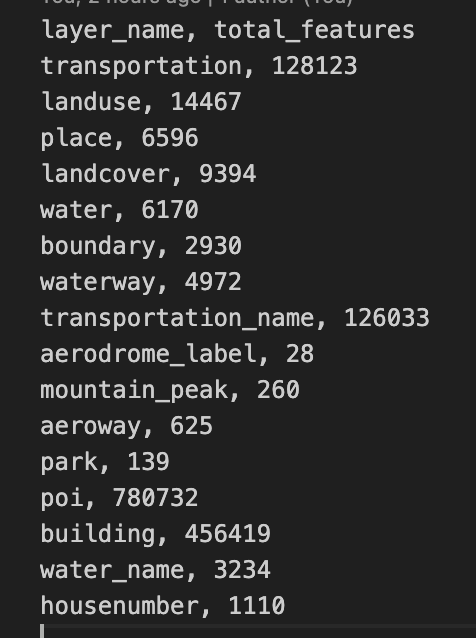

# get-vector-tile-info

Get vector tile total features count in different ways and detailed info on which tile is exceeding its size.

<h1>Installation</h1>
Clone this repository and run npm install
``` npm install ```

<h1>Usage</h1>
 Examining a vector tile to determine whether it complies with Mapbox's suggested maximum tile size of 500 KB and average tile size of 50 KB.

 Also user can get the total features per zoom level, layer-wise total features, the total no of features per tile, get the min and max size of tiles per zoom level.

<h3> Output files</h3>

 

 


<hr>


<h1>How to run</h1>

```
node src/total-features-per-tile.js
```
	 
```
node src/get-layer-feature-count-per-zoom.js
```

```
node src/get-tiles-min-max-size-zoom-wise.js
```
 
```
node src/get-layer-wise-total-feature-count.js
```
